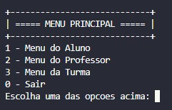
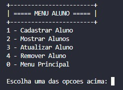
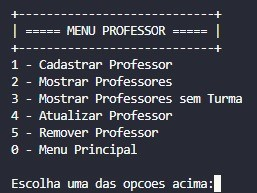
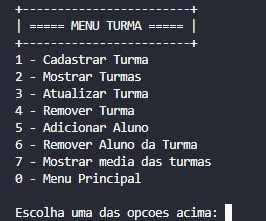

# MENU ESCOLAR :computer:
## O que o projeto faz
Este projeto em C foi desenvolvido para gerenciar informações de alunos, professores e turmas. Ele permite a criação, leitura, atualização e exclusão (CRUD). Com este programa, é possível armazenar e manipular dados como nome, matrícula, endereço, média escolar, etc. O projeto é composto por 4 menus:
* Menu Principal
  * Menu do Aluno
  * Menu do Professor
  * Menu da Turma

# Integrantes

| [<br><sub>Davidson Aguiar</sub>](https://github.com/davidsonaguiar) |  [<br><sub>Hebert Ivisson</sub>](https://github.com/hivisson1002) |  [<br><sub>Caymi Ferreira</sub>](https://github.com/caymiferreira) | [<br><sub>Luis Gustavo</sub>](https://github.com/gustavoataidez) |
| :---: | :---: | :---: | :---: |

## Compilação e Execução
Para compilar e executar o código do projeto com o MinGW, siga as etapas abaixo:

1. Certifique-se de ter o MinGW instalado em seu sistema. Você pode fazer o download do MinGW clicando [aqui](https://sourceforge.net/projects/mingw/).

2. Faça o download ou clone este repositório em sua máquina local.
```
git clone https://github.com/davidsonaguiar/trabalho-final-c.git
```
3. Abra um terminal ou prompt de comando e navegue até o diretório raiz do projeto.
4. Execute o seguinte comando para compilar o código:
```
gcc ./dados/aluno/*.c ./dados/professor/*.c ./dados/turma/*.c ./menus/*.c  *.c  -o main.exe
```
5. Após a conclusão da compilação, execute o seguinte comando para executar o programa:
``
./main.exe
``

## O projeto
* Menu principal


* Menu aluno


* Menu professor


* Menu turma


## Linguagem utilizada

